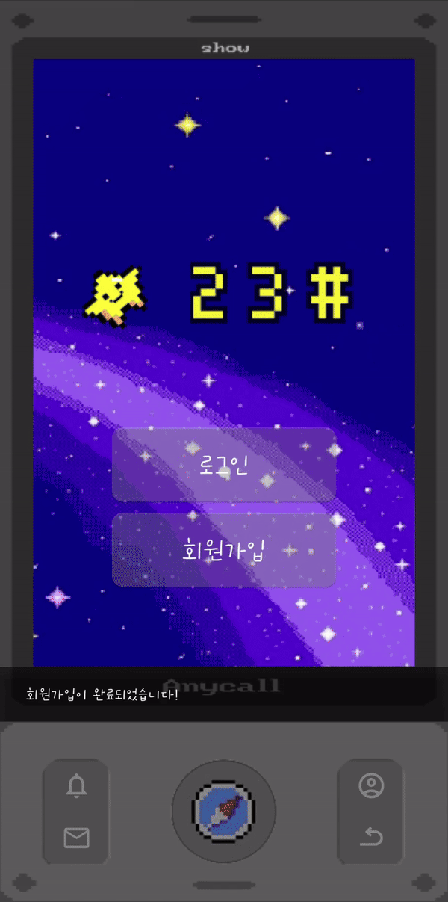
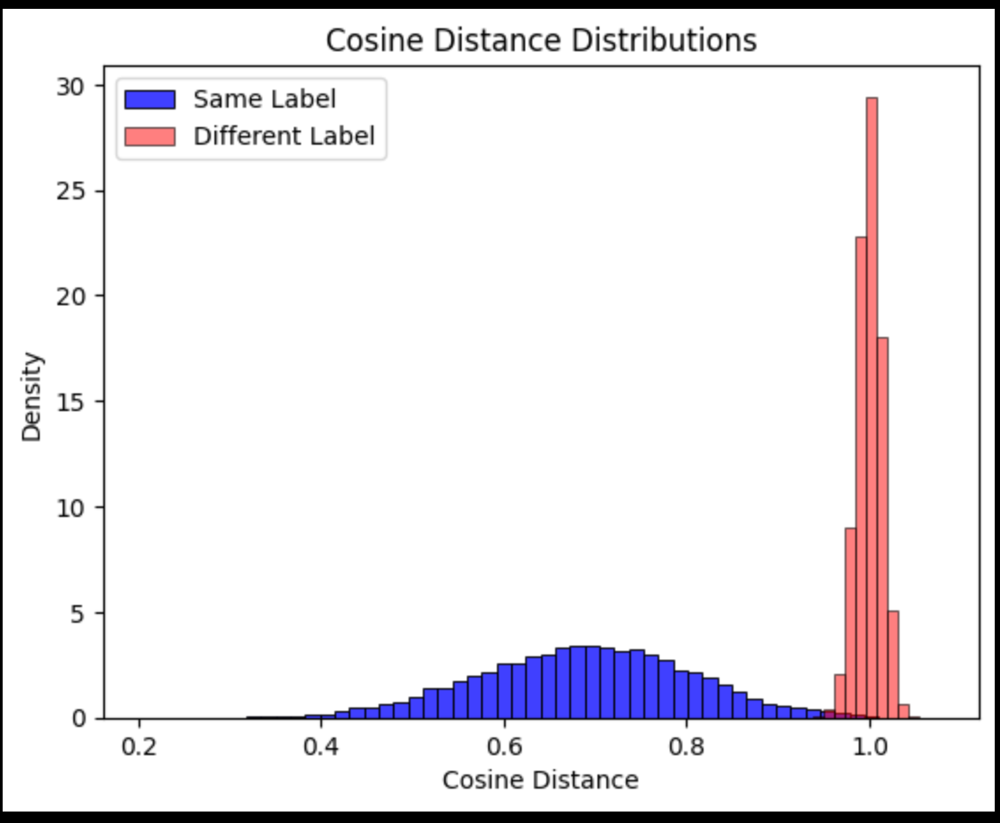
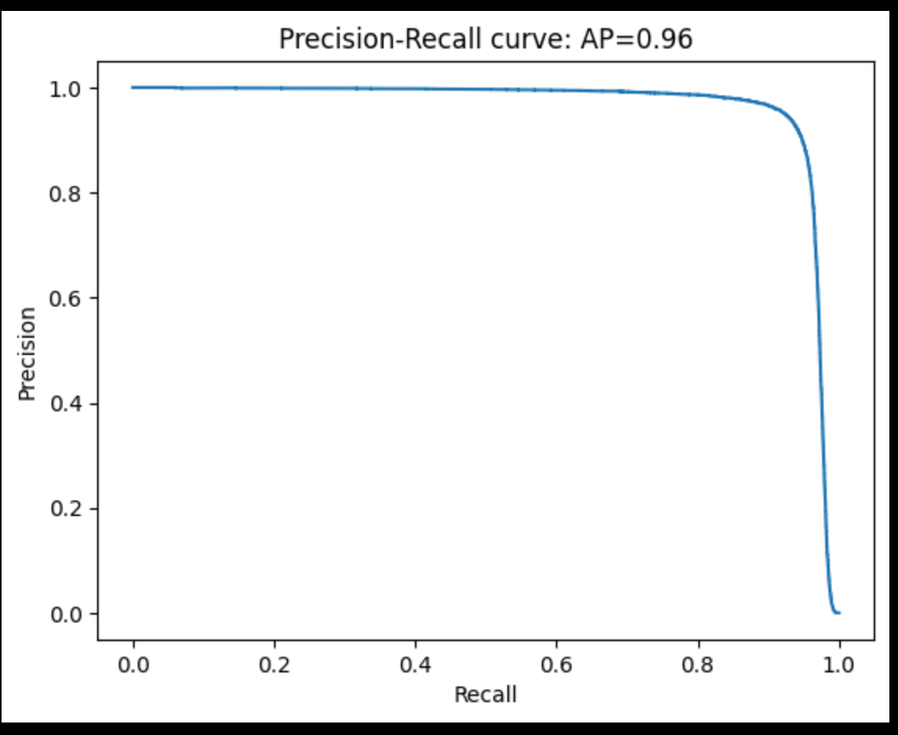

# 별이삼샵✨

## 📬 프로젝트 개요
>📅 개발 기간 : 2024.10.14 ~ 2024.11.19

요즘 우리는 문자나 카카오톡 같은 메신저로 쉽게 대화를 주고받고 있습니다. 

소통이 점점 간편해지고는 있지만, 그 과정에서 느꼈던 설렘이나 기대감은 점점 줄어드는 것 같지 않으신가요?

그래서 편지를 숨기고, 찾아가는 새로운 방식의 커뮤니케이션을 통해 사람들 간의 소통에 재미와 특별함을 더할 수 있는 프로젝트 별이삼샵을 기획하게 되었습니다.

**잊고 지냈던 소통의 재미를 다시 상기시키고, 새로운 방식으로 사람들을 연결하는 서비스 별이삼샵**과 함께 평범한 일상에 설렘을 더해보세요!

## 💌 어플리케이션 아이콘

## 프로젝트 목표
'별이삼샵'의 목표는 다양한 피드백 개선 경험입니다. 이를 위해 세가지 세부 목표를 설정했습니다.

1. 애자일 개발
2. 빠른 배포
3.  클라이언트 피드백 기반 개선

5주 남짓의 기한 내에 피드백을 받기 위해서는 빠른 서비스 개발이 필요했고 그렇기 때문에 애자일 개발 방법론을 채택했습니다.

11월 12일, 18일 두번에 걸쳐 배포를 하고 앱 apk를 다운 받을 수 있는 웹페이지를 제작해 서비스 버전을 관리하며 지속 업데이트를 진행하였습니다

다양한 피드백을 받기 위해서 SSAFY Mattermost 메신저 홍보와 SNS 홍보 및 지인 홍보를 하고, Google Forms를 통한 사용자 설문 조사도 진행했습니다.

실제 사용자의 의견과 피드백을 반영하여 지속적으로 서비스를 개선해 나갔고 또한 웹사이트 분석 툴 Google Analytics를 활용하여 사용자의 행동 패턴, 웹사이트 트래픽, 페이지 이용 시간 등의 유용한 데이터를 수집하고 분석하여 서비스를 개선했습니다.

[홍보 및 피드백 자료]()

## 주요 기능

- **보물 쪽지 숨기기**
    - 쪽지를 숨기려는 장소의 사진과 힌트 텍스트를 등록해 그 장소에 쪽지를 숨깁니다.
    - 장소 사진은 픽셀화되어 수신자에게 힌트로 제공됩니다.
    - 힌트 등록 후 수신인, 쪽지 제목, 내용을 작성합니다.
    - 모두에게, 수신자 여러명 등록이 가능합니다.
- **보물 쪽지 찾기**
    - 쪽지를 숨긴 위치에 가서 힌트 사진에 등록된 장소를 사진으로 찍어 보물 속 숨겨진 쪽지를 확인할 수 있습니다.
    - 위치와 장소가 일치하지 않으면 쪽지 열람이 불가합니다.
- **일반 쪽지 보내기**
    - 수신인, 쪽지 제목, 내용을 작성합니다.
- **GPT 기반 문체 변경**
    - 쪽지 내용을 다양한 문체로 변경할 수 있습니다.
    귀여니체, 하오체, 휴먼급식체, 오덕체, 중2병체, 했삼체
- **친구 즐겨찾기**
    - 자주 소통하는 친구를 등록해 더 편하게 쪽지를 주고 받을 수 있습니다.
- **테마 변경**
    - 다양한 테마를 통해 아날로그 감성을 느낄 수 있습니다.
- **실시간 알림**
    - 쪽지를 수신했을 때 실시간으로 알림을 받을 수 있습니다.

## 서비스 화면
### 홈 화면
- 옛날 피쳐폰 ui를 앱 기본 레이아웃으로 넣어 더욱 레트로스럽고 귀엽게 디자인했습니다.
- 로그인 상태라면 앱 네이게이션 메뉴를 보여주고 
  로그아웃 상태라면 로그인과 회원가입이 접근 가능합니다.
- 로그인 상태에 따라 화면을 달리  보여줍니다.
- 읽지 않은 쪽지가 있으면 홈 화면의 쪽지 보관함 메뉴에 빨간 점이 표시됩니다.
### 로그인, 회원가입 화면
- 간단한 아이디, 닉네임 중복확인을 통해 회원가입을 할 수 있습니다. 
<table>
  <tr>
    <th>회원가입</th>
    <th>로그인</th>
  </tr>
  <tr>
    <td>
      
    </td>
    <td>
      
    </td>
    
  </tr>
</table>
### 쪽지 보관함
- 홈화면의 쪽지 보관함 메뉴와 앱 하단의 편지 아이콘을 통해 접근할 수 있습니다.
- 받은 쪽지를 기본으로 보여주며 탭을 통해 보낸 쪽지도 확인 가능합니다.
- 필터를 통해 보물쪽지와 일반 쪽지를 나눠서 볼 수 있습니다.
- 리스트에 요소를 클릭하면 해당 쪽지의 상세페이지로 이동합니다. 
- 리스트의 별을 통해 쪽지의 종류를 구분할 수 있습니다.
  - 하얀 별 :  일반 쪽지
  - 노란 별 :  보물 쪽지
  - 별 하나 : 개인 쪽지
  - 별 두개 : 그룹 쪽지
  

### 지도 화면 
- 앱 하단의  나침반 아이콘을 통해 접근할 수 있습니다.
- 각 보물 쪽지들은 숨겨진에 별 마커로 표시됩니다.
- 별 마커를 클릭하면 모달과 함께 보물 쪽지에 대한 힌트 정보를 확인할 수 있습니다.

  ### 보물 쪽지 보내기
  - 지도 화면에 편지+ 버튼과 홈 화면의 보물 쪽지 메뉴를 통해 접근할 수 있습니다.
  - 힌트로 제출할 사진을 두장 찍고 글로도 힌트를 남길 수 있습니다.

  ### 보물 쪽지 찾기
  - 아직 아무도 찾지 않은 별 마커를 클릭했을 경우 '사진 속 장소 찾기' 버튼을 통해 보물 쪽지 찾기를 진행합니다.
  - 장소가 일치한다면 힌트로 사용된 이미지의 원본과 쪽지를 확인할 수 있고, 쪽지 보관함에서도 쪽지를 볼 수 있습니다.

### 알림
- 보물 쪽지를 받으면 푸시 알림을 통해 힌트와 장소를 확인할 수 있습니다.
- 푸시 알림을 클릭하면 알림함으로 이동해 상세한 정보를 확인할 수 있습니다.

### 테마
- 검정, 하늘, 분홍색으로 총 3가지 색의 테마를 제공합니다.
- 테마 별 메인 컬러가 변경돼 다양한 화면을 경험할 수 있습니다.

### 즐겨찾기
- 친구 닉네임을 자신이 정한 별칭으로 저장할 수 있습니다. 

## 기술 특장점
### AI 기반 장소 인증 시스템
#### 장소 인식 AI 모델
- [CVPR 2024](https://cvpr.thecvf.com/Conferences/2024) 에 등재된 논문 [Bag of Queries: A Place is Worth a Bag of Learnable Queries](https://openaccess.thecvf.com/content/CVPR2024/papers/Ali-bey_BoQ_A_Place_is_Worth_a_Bag_of_Learnable_Queries_CVPR_2024_paper.pdf) 의 [모델](https://github.com/amaralibey/Bag-of-Queries) 을 사용
	- 사진에 찍힌 장소를 인식하는 AI
	- GPS와 연계하여 보물 쪽지 인증에 사용됨
- AI 모델 벤치마크
    - 벡터간의 코사인 거리로 Classification Task의 수행이 가능한지 보기 위한 벤치마크
    - 사용 데이터셋: [GSV-Cities](https://github.com/amaralibey/gsv-cities)
        - 데이터셋 중 일부를 샘플링하여 벤치마크에 활용
            - 3만 5천개의 장소
            - 5만 2천개의 이미지
    - [Cosine Distance](https://en.wikipedia.org/wiki/Cosine_similarity#Cosine_distance) Distribution
        - 히스토그램 
         
        - Cosine distance 통계
            - Same-label cosine distance
                - Mean: 0.6880
                - Std: 0.1158
            - Different-label cosine distance
                - Mean: 0.9999
                - Std: 0.0134

        - 같은 장소에 대한 사진의 벡터간의 Cosine distance와, 다른 장소에 대한 사진의 벡터간의 Cosine distance가 **잘 구분되는 Distribution을 가짐을 알 수 있음**
    - Classification 성능 지표
        - Precision-Recall Curve 
              
        - Classification Threshold 0.8491 에서 F1 Score 0.9365
#### 보물 쪽지 저장

1. 같은 장소의 사진 두 장을 찍어 업로드
2. AI 모델에 입력되어 Vector Representation 생성
3. 두 벡터의 평균을 Vector Database에 저장
#### 보물 쪽지 찾기

1. 보물 쪽지가 숨겨진 장소를 찍어 업로드
2. AI 모델에 입력되어 Vector Representation 생성
3. DB에 저장되어있던 Vector와 Cosine 거리를 비교하여 거리가 임계값(0.8491) 미만이면 같은 장소로 판정
### [Race Condition](https://en.wikipedia.org/wiki/Race_condition#Data_race) 방지

- [Row level lock](https://www.postgresql.org/docs/current/explicit-locking.html#LOCKING-ROWS) 을 도입하여 성능 손실을 최소화하면서 안정적인 Transaction을 구현
- 보물 쪽지 인증 시 발생할 수 있는 잠재적인 Race Condition 해결

## 프로젝트 산출물

## ⚙ 개발환경

### Backend

- **Java** : Oracle Open JDK 17
- **Spring Boot** : 3.2.11
- **JPA** : hibernate-core-6.4.10
- **IntelliJ :** 2024.1.4

### AI

- **Python** : 3.12
- **Pytorch** : 2.4.1
- **fastapi** : 0.115.2
- **python-multipart** : 0.0.12
- **uvicorn** : 0.32.0
- **transformers(Huggingface)** : 4.46.2

### Android
- **flutter** : 3.5.4
- **dio** : 5.7.0
- **provider** : 6.1.2
- **kakao_map_plugin** : 0.3.2
- **firebase_core** : 3.6.0 

### Server

- **Ubuntu** : 20.04.6 LTS
- **Nginx** : 1.27.2
- **Docker** :  27.3.1
- **Docker Compose** : 2.29.7
- **Jenkins** : 2.462.3

### Database

- **Postgresql** : 17
- **Redis** : 7.2.0

### UI / UX

- **Figma**

### 형상 / 이슈관리

- **Gitlab**
- **Jira**

### 웹사이트 분석/관리

- **Google Analytics 4**

### 기타 툴

- **Postman**

## 프로젝트 산출물

## 😊 팀원

### **'줄게마갤럭시'** 팀 소개

|                                                                    [전영주(팀장)](https://github.com/Jeon-YJ1004)                                                                    |                        [김민호](https://github.com/km9404)                         |                           [목요빈](https://github.com/yobinmok)                           |                           [이동준](https://github.com/djleeasi)                            |                        [이수현](https://github.com/lshyunee)                         |                            [윤진섭]https://github.com/jinseobYun)                            |
| :-----------------------------------------------------------------------------------------------------------------------------------------------------------------------: | :---------------------------------------------------------------------------------------: | :---------------------------------------------------------------------------------------: | :---------------------------------------------------------------------------------------: | :---------------------------------------------------------------------------------------: | :----------------------------------------------------------------------------------------: |
|  |  |  |  |  |  |
|                                                                               **Frontend**                                                                                |                                        **Frontend**                                        |                                        **Frontend**                                        |                                       **AI / BE**                                        |                                      **Infra / BE**                                       |                                        **Backend**                                         |

### 팀원 역할

**FrontEnd**

- 전영주
  - 팀장
  - 쓰세욥
- 김민호
  - 보물쪽지
	  - 쪽지 작성 이미지 처리 부분 화면
	  - 지도 부분 화면
	  - 보물쪽지 힌트, 검증, 상세 보기
- 목요빈
	- 회원 및 토큰 관리 API 연결
	- 로그인 및 회원가입 화면 구현, API 연결
	- 쪽지 리스트 및 개별 조회 화면 구현, API 연결
	- 프로필 및 테마 화면 구현

**BackEnd**

- 이동준
   - FastAPI 서버 REST API 개발
	  - 보물 쪽지 작성
	  - 주변의 보물 쪽지 조회
	  - 보물 쪽지 인증
  - 벡터 Database 구축
	  - AI 와 함께 활용
	  - 위/경도를 직교좌표 벡터로 변환하여 주변의 보물 쪽지 검색 최적화
  
- 이수현
  - Spring Boot 서버 REST API 개발
    - 일반 쪽지 작성
    - 수신 & 발신 쪽지 리스트
    - 수신 & 발신 쪽지 상세보기
    - 안 읽은 쪽지 여부 확인
    - 쪽지 삭제
    - push 알림 (알림 전송 & 알림 리스트 & 알림 상세보기 & 알림 on/off 토글)
  - 카카오 지도 API 사용하여 위•경도 주소로 변환
  - S3 버킷 관리 & 이미지 업로드 처리 서비스 작성
  
- 윤진섭
  - Spring Boot 서버 REST API 개발
	  - Spring Security와 JWT를 활용한 로그인, 로그아웃 및 인증/인가 구현
	  - Redis 를 활용한 JWT Token 관리
		- 회원가입 및 회원 정보 조회
		- 친구 즐겨찾기 관리 (닉네임 및 별칭 저장, 수정, 삭제)
	  - 수신 & 발신 쪽지 리스트
	  
**Infra**

- 이수현
  - Jenkins CI/CD Pipeline를 통한 SpringBoot & FastAPI 빌드/배포 자동화 시스템 구축
  - AWS EC2 환경설정 (Nginx, Docker, Postgresql, Redis 등)
  - Docker Compose를 사용하여 애플리케이션 환경 컨테이너화

**AI**

- 이동준
    - FastAPI GPU 서버 개발
	  - 장소 인식 AI
	  - 이미지 효과 처리

## 회고
